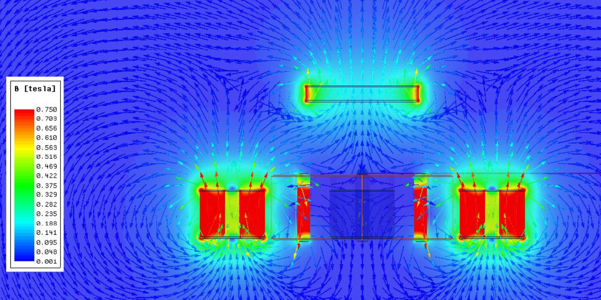

# ArdMagLev
This Project is based on the [AirBonsai](https://www.instructables.com/id/Arduino-Air-Bonsai-Levitation/)-Project from FunLab.  

- [General Setup](#general-setup)
- [Initial Problems](#initial-problems)
- [Improvments](#improvments)
- [Result](#result)
- [Remaining Problems](#remaining-problems)
- [TODO's](#todos)

## General Setup
### IDE
[PlatformIO ](https://platformio.org/platformio-ide)

### Board
Arduino Leonardo

## Initial Problems

### Coils
One of the biggest Problems is, that the generated Field of the Coils will disturb your Hallsensor.  
Without the correct Sensorvalue you won't be able to controll the position.
[TODO: Add Calculation Tau]
### Position of the Hallsensor
The proposed setup with the Breadboard has the disadvantage, that you're not able to orient the Hallsensor correctly. Horizontal und vertical displacements have a negative influence on the precision of the Sensors and increase the disturbance from the Coils.  

As you can see in the Image below the Sensor will detect the Field from the Coils much more if they are not completly parallel.

## Improvements

### System-Overview

### Hardware

### 3D-Print
To solve the Position-Problem and make a more reproducible Design a 3D-Print was created. 

[Check the Folder](./3D-Data/) for the .stl or .prt (Siemens NX 12)

### Hall-Sensors
[SS495A-S Datasheet](https://sensing.honeywell.com/honeywell-sensing-sensors-linear-hall-effect-ics-ss490-series-datasheet-005843-2-en.pdf)  
To minimize the Coil-influence, two more Hallsensores were added.

### Software
#### Preprocessor Directives
To switch between the different Modes comment or uncomment the #defines at the beginning of the Sketch.

##### MYDEBUG
This Mode will display debugg-messages over the Serial-Port

##### MYTIMING
This Mode will display the time needed for one Loop  over the Serial-Port

##### TESTX
This Mode will power the Coils on the X-Axis in Steps from 0 to 255 and 0 to -255.  

At 255 your Input_X should be an negativ Value.  
At -255 your Input_X should be an positiv Value.
##### TESTY
This Mode will power the Coils on the Y-Axis in Steps from 0 to 255 and 0 to -255.  

At 255 your Input_Y should be an negativ Value.  
At -255 your Input_Y should be an positiv Value.
##### TESTXY
This Mode will move your Magnet in an rectangle.

##### CONTROLL
This Mode will activate the PID-Controller.

##### AUTOSHUTDOWN
This Mode will activate the Autoshutdown.  
If your Controll fails and the Magnet falls from its centerpoint the Controller will set the PWM to 100%. This will overheat your Coils and destroy them.  

To prevent this, the Autoshutdown will power off the Coils if the Output is too high for too long.

##### BREAKMODE

An Instructabel User recommended to use the breaking mode for the H-Bridge.  

>After playing around with the H bridge I found that its output current is way more predictable by leaving the jumpers on ENA and ENB, and applying pwm directly to the IN pins: (eg: If the output value from the pid is positive, IN1 is low, and IN2 is fed the pwm wave. If the output is negative, IN2 is low, and IN1 is fed the pwm wave). This is the "braking mode" when the bridge is used to drive dc motors, so the coil ends are short circuited between the pwm pulses instead of being at high impedance.
> -- <cite> Simo_Dax </cite> 

#### Corrct Coil-Influence
The function *corr_sensor_x* and *corr_sensor_y* will read the actual PWM-Output and calculate the error generated in the Sensors. You probably will need to update this calculation for your own setup.

## Result
[Video](./images/ardmaglev.mp4)

### Technical Details
- Max Load: [Todo: measure]
- Normal Power-consumption: ca. 0.4 A
- Max Power-consumption: ca. 2.5 A

## Remaining Problems

### Tuning/Stability
A little bit of luck is needed to find the correct parameters. If your about 0.2 off it will probably not be stable.

### Noise
Unfortunately because of the low PWM frequency the Coils are VERY noisy.  
An Higher PWM frequency would solve this Problem.

### Magnet detection
There is no Standby-Mode atm. A Function for the detection of the floating Magnet is necessary.

## TODOs
Feel free to contribute
- Improve Instructions
- Update Controller for Higher PWM and to minimize Coil-Noise
- Implement detection for the floating magnet
- Write an PID-Controller and delete the library
